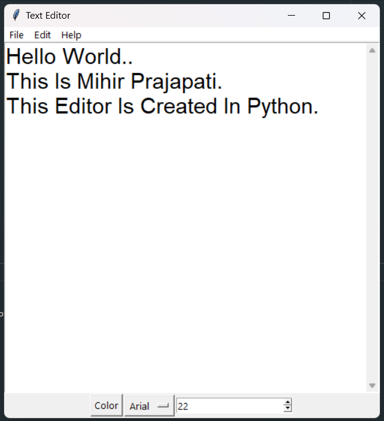

# Basic Text Editor

This is a basic text editor.
written by me under a code clause python development internship.

* language : python
* IDE : PyCharm

### Modules Used
    1. Os
    2. tkinter
    

### Functionalities
1. **File**
    - Open - Open A Existing File.
    - New - Create A New File.
    - Save - Save Current File.
    - Exit - Exit Editor.
2. **Edit**
    * Cut - Cut Selected Text.
    * Copy - Copy Selected Text.
    * Paste - Paste Text.
3. **Font**
    * Font Color - Change The Font Color.
    * Font Style - Change The Font Style.
    * Font Size - Change The Font Size.
## Screenshots
    

